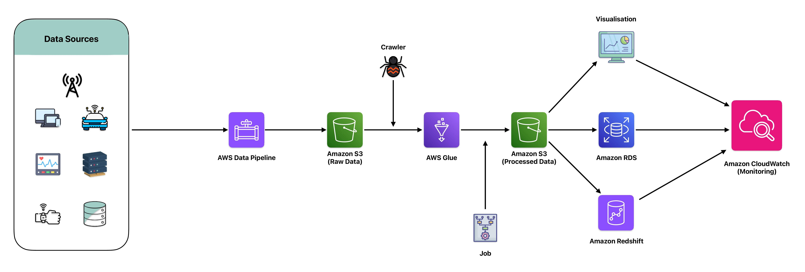

# Data Silos and Integration Solution - Unified Data Lake

In the age of big data, businesses often find themselves dealing with disparate data sources. These sources can range from on-premises databases and third-party APIs to streaming data from IoT devices and file-based data. The challenge lies in integrating this diverse data into a cohesive system that allows for efficient storage, processing, and analysis. Many organizations struggle with data silos, making it difficult to gain comprehensive insights and drive informed decision-making.

## Sample Scenario - MadHatter Corp.

`MadHatter Corp.`, a leading provider of innovative consumer products, finds itself grappling with disparate data sources that are essential for its operations. These sources range from on-premises databases housing customer information and transactional records, third-party APIs providing market trends and competitive intelligence, to streaming data from IoT devices embedded in their products and file-based data such as sales reports and inventory logs.

The challenge for `MadHatter Corp.` lies in integrating this diverse data into a cohesive system that allows for efficient storage, processing, and analysis. Currently, their data is siloed, and stored in various isolated systems without a unified approach, making it difficult to gain comprehensive insights and drive informed decision-making. The lack of integration hinders their ability to perform advanced analytics, optimize their supply chain, and personalize customer experiences based on real-time data.

To address this challenge, `MadHatter Corp.` implemented a unified data lake solution using AWS services. This architecture leverages Amazon S3 as a scalable data lake, providing a central repository for all their data. AWS Glue is utilized for seamless ETL tasks, transforming and preparing data for analysis. AWS Data Pipeline automates the movement of data between sources, ensuring timely and accurate data flows. Amazon RDS is used for relational data storage, maintaining the integrity of transactional data, while Amazon Redshift serves as their data warehouse, enabling complex queries and in-depth analytics.

By integrating these services, `MadHatter Corp.` has successfully brought together data from multiple sources into a unified data lake. This solution facilitates efficient storage, processing, and analysis of their data, enabling the company to break down data silos, gain comprehensive insights, and make data-driven decisions. As a result, MadHatter Corp. is better positioned to enhance its product offerings, optimize operations, and deliver exceptional customer experiences.

## AWS Tools Used - DeepDive

### Amazon S3 (Simple Storage Service)

`Amazon S3` is a scalable and durable storage service designed to store and retrieve any amount of data from anywhere on the web. It serves as the backbone for our unified data lake, providing a secure and reliable environment for storing raw, processed, and archived data.

    

#### Key Features:

- Scalability: Automatically scales to meet growing data storage needs without requiring upfront investments.
- Durability and Availability: Offers 99.999999999% durability and 99.99% availability over a given year, ensuring data is always accessible.
- Security: Provides comprehensive security features, including encryption at rest and in transit, access control policies, and integration with AWS Identity and Access Management (IAM) for fine-grained permissions.
- Lifecycle Management: Allows automated tiering of data to lower-cost storage classes as it ages, optimizing cost management.
- Data Transfer Acceleration: Enhances data transfer speeds to and from Amazon S3 buckets through optimized network paths.

#### Use in Project:
In our integrated data lake solution, `Amazon S3` serves as the central repository where all raw data from various sources is ingested and stored. It also holds the transformed and processed data, making it easily accessible for further analysis and reporting.

### AWS Glue

`AWS Glue` is a fully managed extract, transform, and load (ETL) service that makes it easy to prepare and load data for analytics. It automates much of the effort involved in data preparation, allowing users to discover, transform, and catalog data efficiently.

    

#### Key Features:

- Data Cataloging: Automatically discovers and catalogs metadata about data assets, making it easier to search and query.
- ETL Automation: Provides a serverless environment to run ETL jobs with auto-scaling capabilities.
- Developer-Friendly: Supports both visual and code-based interfaces for building ETL workflows, using Glue Studio and Glue API/SDKs.
- Integrated Data Processing: Seamlessly integrates with Amazon S3, Redshift, RDS, and other data sources.

#### Use in Project:
`AWS Glue` is utilized for its powerful ETL capabilities. We use `Glue Crawlers` to automatically discover data schemas in our S3 buckets, and `Glue Jobs` to perform transformations on the raw data, converting it into a more structured format suitable for analysis.

### AWS Data Pipeline

`AWS Data Pipeline` is a web service that helps automate the movement and transformation of data. It provides a simple, reliable way to process and transfer data across various AWS services and on-premises data sources.

    

#### Key Features:

- Orchestration: Manages and orchestrates complex data workflows and dependencies.
- Scheduling: Allows scheduling of data movement and transformation tasks, ensuring timely data processing.
- Fault Tolerance: Automatically retries failed activities and provides detailed logs for troubleshooting.
- Integration: Supports seamless integration with other AWS services, such as S3, RDS, and Redshift.

#### Use in Project:
`AWS Data Pipeline` is employed to automate the data flow between our various sources and destinations. It schedules regular data transfers from on-premises databases and third-party APIs into our S3 data lake, and from S3 to Redshift for warehousing.

### Amazon RDS (Relational Database Service)

`Amazon RDS` is a managed relational database service that simplifies the setup, operation, and scaling of databases in the cloud. It supports multiple database engines, including MySQL, PostgreSQL, and Oracle.

    

#### Key Features:

- Automated Administration: Handles routine database tasks such as provisioning, patching, backup, and recovery.
- Scalability: Easily scales compute and storage resources with a few clicks or API calls.
- High Availability: Offers Multi-AZ deployments for enhanced availability and durability.
- Security: Provides data encryption at rest and in transit, VPC isolation, and IAM integration.

#### Use in Project:
`Amazon RDS` is used for storing structured, relational data that requires transactional consistency and integrity. It ensures that our relational data is reliable, secure, and easily accessible for analytical queries.

### Amazon Redshift

`Amazon Redshift` is a fast, fully managed data warehouse that makes it simple and cost-effective to analyze large volumes of data using SQL. It enables running complex queries and performing sophisticated analytics on big data.

    

#### Key Features:

- High Performance: Delivers fast query performance through columnar storage, data compression, and parallel query execution.
- Scalability: Scales from a few hundred gigabytes to a petabyte or more of data.
- Cost-Effective: Offers on-demand pricing and reserved instance pricing models.
- Integration: Integrates with a wide range of AWS services, including S3, Glue, and Data Pipeline.

#### Use in Project:
`Amazon Redshift` is our data warehousing solution, where we load processed data from S3 for deep analytics. It allows us to run complex queries, generate reports, and gain insights from our integrated data lake.

## References
- [Amazon S3 Documentation](https://docs.aws.amazon.com/s3/)
- [AWS Glue Documentation](https://docs.aws.amazon.com/glue/)
- [AWS Data Pipeline Documentation](https://docs.aws.amazon.com/datapipeline/)
- [Amazon RDS Documentation](https://docs.aws.amazon.com/rds/)
- [Amazon Redshift Documentation](https://docs.aws.amazon.com/redshift/)

